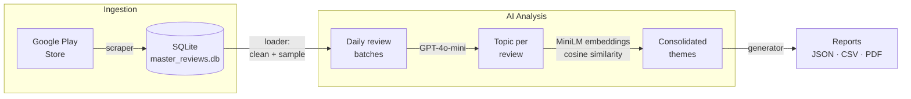

# PulseGen — App Review Analysis Engine

PulseGen is a modular CLI pipeline that scrapes Google Play Store reviews, stores
them in a local database, and uses an LLM plus sentence embeddings to surface the
main topics and complaint trends over time. It generates daily trend reports in
JSON, CSV, and PDF.

> Built as a demo/portfolio project. Reviews are public Google Play data; be
> mindful of Google's terms and of user privacy when scraping and sharing data.

**Video demo:** https://drive.google.com/drive/folders/1Is8L_8c_qsMUjla-s-7EPMj5X7uQcoiP?usp=sharing

---

## What is this?

Popular apps (Zomato, Swiggy, Blinkit) collect **thousands of Play Store reviews
every week** — far too many to read by hand. Buried in that noise are the answers
product and support teams actually need:

- What are users complaining about most right now?
- Is a problem *new* this week, or has it always been there?
- Did a complaint spike on a specific day — after a release or an outage?

**PulseGen answers those questions automatically.** Point it at an app, give it a
date range, and it returns a ranked, day-by-day breakdown of complaint themes —
plus the exact reviews behind every number.

## What it does

- **Scrapes** every Play Store review for an app in a date range — across 5 star
  ratings and 5 Indian languages, in parallel.
- **Stores** them in a local SQLite database so re-runs are incremental (no
  re-fetching).
- **Understands** each review with an LLM: assigns a topic (e.g. *Delivery Issues*,
  *Payment Issues*) and a type (*complaint / request / compliment*).
- **Groups** near-duplicate topics using sentence embeddings, then consolidates
  them into a clean set of high-level themes.
- **Reports** a topic × date trend table showing what users are unhappy about and
  **when** — as JSON, CSV, and PDF.

**In one line:** it turns thousands of raw app reviews into a "what's breaking and
when" trend report. See [Sample results](#sample-results--swiggy-jul-1722-2025)
for a real run.

## How it works



1. **Scrape** — `data_ingestion/scraper.py` fetches reviews in parallel across
   5 star ratings and 5 languages (en, hi, mr, bn, te), de-duplicated and filtered
   to the requested date range.
2. **Store** — `database/db_manager.py` writes to a local SQLite database
   (`apps` + `reviews` tables), inserting only new reviews.
3. **Load & sample** — `data_ingestion/loader.py` preprocesses text (lowercase,
   strip emojis), drops very short reviews, and samples up to 200 reviews per day.
4. **Analyze** — `analysis/agent.py` uses `gpt-4o-mini` to extract a topic per
   review, then consolidates near-duplicate topics with `all-MiniLM-L6-v2`
   embeddings + cosine similarity, and finally groups them into high-level
   categories with a second LLM pass. Days are processed in parallel.
5. **Report** — `reporting/generator.py` builds a topic × date trend table and
   writes JSON, CSV, and a landscape PDF into `output/`.

## Project structure

```
pulse_engine/            Core package
  data_ingestion/        Scraper + DB loader/sampler
  database/              SQLite schema & inserts
  analysis/              LLM agent + text preprocessing
  reporting/             JSON / CSV / PDF report generation
app.py                   CLI entry point (full pipeline)
config.py                Apps to analyze + DB path; loads OPENAI_API_KEY
data/                    Local SQLite DB + scraped JSON (git-ignored)
output/                  Generated reports (sample PDFs are committed as demos)
scripts/                 Standalone dev/helper scripts (superseded by pulse_engine)
tests/                   Ad-hoc API test scripts
```

## Setup

Requires Python 3.9+ and an OpenAI API key.

```bash
# 1. Install dependencies
python -m venv venv
source venv/bin/activate
pip install -r requirements.txt

# 2. Configure secrets
cp .env.example .env
# then edit .env and set OPENAI_API_KEY
```

`config.py` reads keys from `.env` via `python-dotenv`. Never commit `.env`.

## Usage

By default PulseGen analyzes the last 30 days. Reports land in `output/`.

**Analyze all apps defined in `config.py`:**

```bash
python app.py
```

**Analyze a single app by Play Store URL:**

```bash
python app.py \
  --url "https://play.google.com/store/apps/details?id=com.application.zomato" \
  --app_name "Zomato"
```

**Custom date range** (works with either mode):

```bash
python app.py --start-date "2025-07-01" --end-date "2025-07-31"
```

### CLI options

| Flag | Description |
|------|-------------|
| `--url` | Play Store URL to analyze a single app |
| `--app_name` | Display name when using `--url` |
| `--start-date` | Start date `YYYY-MM-DD` (default: 30 days ago) |
| `--end-date` | End date `YYYY-MM-DD` (default: today) |

### Configuring apps

Edit `APPS_TO_ANALYZE` in `config.py`:

```python
APPS_TO_ANALYZE = [
    {
        "app_name": "Zomato",
        "app_id": "com.application.zomato",
        "output_dir": "output/zomato_report",
    },
    # add more apps here
]
```

## Output

Each run produces, per app / date range:

- `trend_report_<range>.json` — topic trends + top-topic summary
- `topic_review_details_<range>.csv` — every review mapped to its topic
- `trend_report_<range>.pdf` — landscape trend table

Sample PDFs are committed in `output/` as examples.

## Sample results — Swiggy (Jul 17–22, 2025)

A real run over 1,197 Google Play reviews (`in.swiggy.android`), analyzed across
5 languages and consolidated into 17 themes.

📊 **[Interactive dashboard](https://claude.ai/code/artifact/a0b6a635-bb39-4aa3-9937-562f8f0edcb6)** — heatmap, trends, and the real reviews behind each number.

**Top complaint themes (6-day totals):**

| Rank | Theme | Mentions |
|------|-------|---------:|
| 1 | Delivery Issues | 214 |
| 2 | Customer Service Issues | 206 |
| 3 | Feedback (mixed/positive) | 172 |
| 4 | Pricing | 124 |
| 5 | Payment Issues | 97 |
| 6 | App Performance | 71 |
| 7 | Food Quality | 71 |

**What the trend surfaced:**

- **Delivery Issues** spiked to **53 mentions on Jul 20** (vs ~27 baseline) — the
  single largest daily signal in the window.
- **Customer Service** stayed consistently high (30–45/day) — a chronic issue, not a spike.
- Recurring complaint driver across themes: **cancellation fees charged on
  near-instant cancellations** and **failed-payment refunds** — visible in the
  sample reviews for Payment and Pricing.

*Run cost ≈ **$0.03** in OpenAI usage (`gpt-4o-mini`).*

## Tech stack

OpenAI (`gpt-4o-mini`) · `sentence-transformers` (MiniLM) · scikit-learn ·
pandas · `google-play-scraper` · SQLite · `fpdf2`

## License

[MIT](LICENSE)
